# non-blocking-io vs blocking-io

1. 🔵 `Taditional` - blocking io
2. 🟠 `Mono` - none blocking io
3. 🟢 `CompletableFuture` - none blocking io

## Sample process: load test result (User: 500, Rump Up: 10, 5 min)
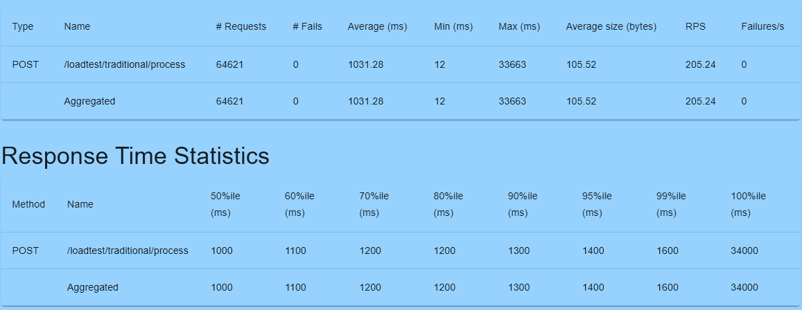 
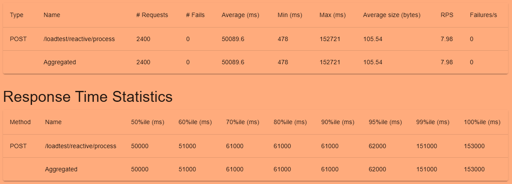 
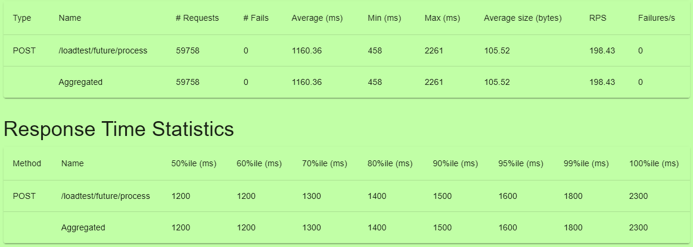 

## IO process: load test result (User: 500, Rump Up: 10, 5 min)
 
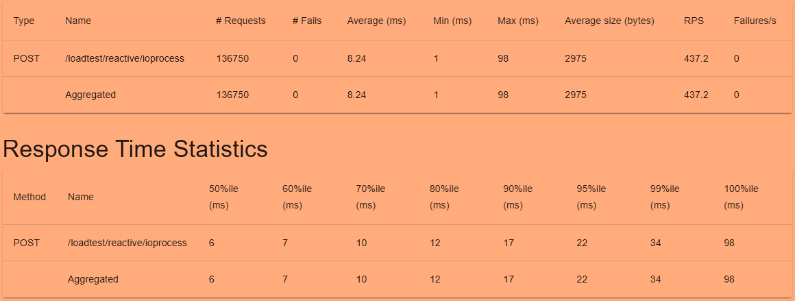 
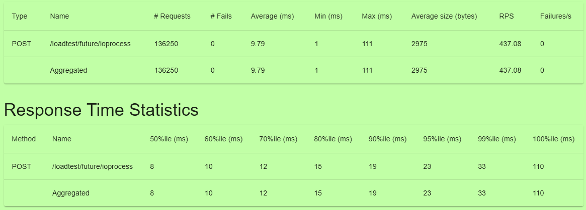 

## mongodb process: load test result (User: 500, Rump Up: 10, 5 min)
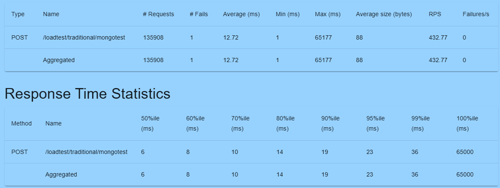 
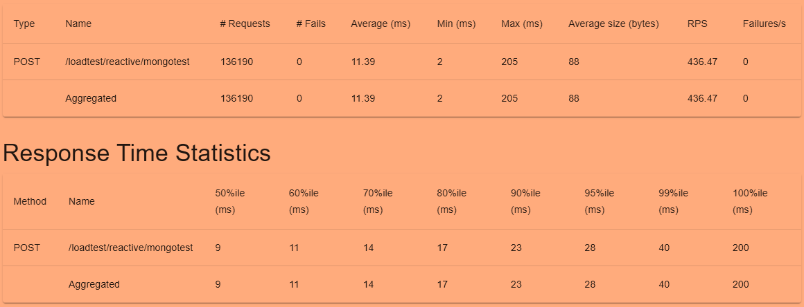 
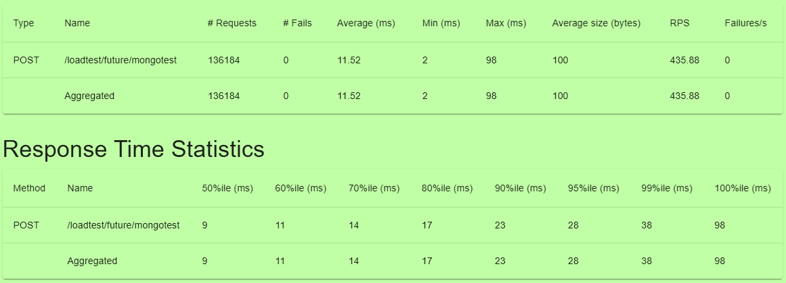 

## External REST API Call: load test result (User: 500, Rump Up: 10, 5 min)
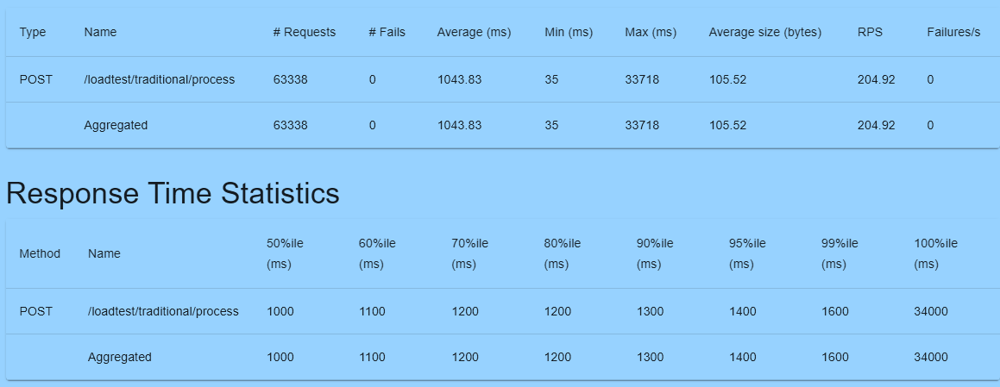 
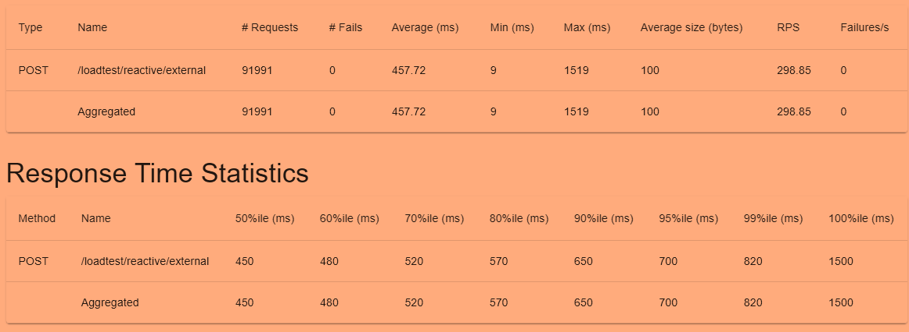 
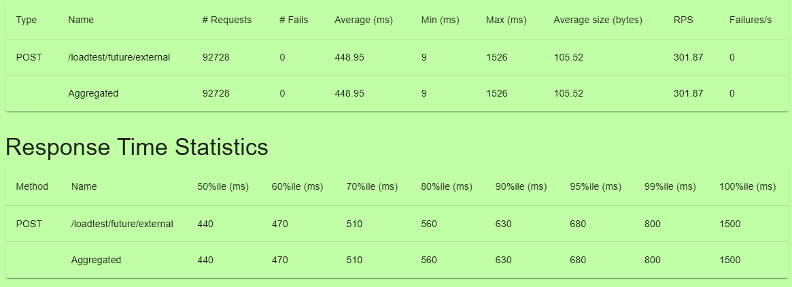 
