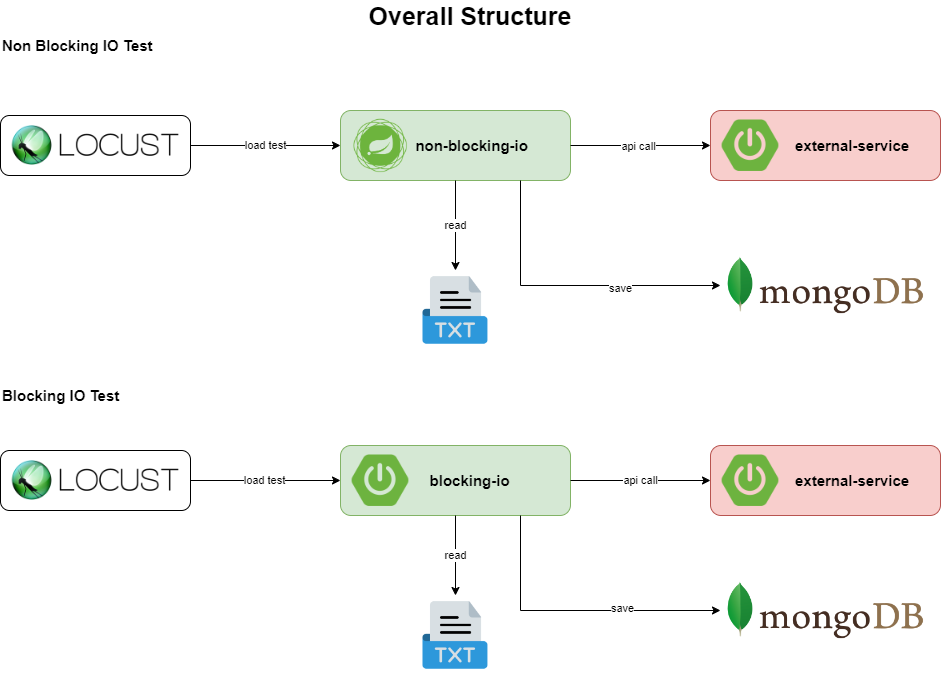

# non-blocking-io vs blocking-io
<br>
---
#### Rresouce Limit Config Example
```xml
<plugin>
  <groupId>org.springframework.boot</groupId>
  <artifactId>spring-boot-maven-plugin</artifactId>
  <configuration>
    <jvmArguments>-Xms256m -Xmx512m -XX:ActiveProcessorCount=2</jvmArguments>
  </configuration>
</plugin>
```
#### Mongodb
```
mongodb docker compose file `mongodb/mongodb-docker-compose.yaml`
```

#### Run Locust Docker with lode test script
```
cd <PATH>/locust
```
Run specific script. (eg; springboot Mono load test with `Mongodb`)
```
docker run -p 8089:8089 -v $(pwd):/mnt/locust locustio/locust -f /mnt/locust/reactive_mongo_load_test.py
```
---
# load test result for each process
All of result are tested by 500 users, ramp up period 10 sec, durration 5 min.

1. 🔵 `Taditional` - blocking io
2. 🟠 `Mono` - none blocking io
3. 🟢 `CompletableFuture` - none blocking io

## Sample process
<br>
<br>
<br>

## IO process
<br>
<br>
<br>

## Mongodb process
<br>
<br>
<br>

## External REST API Call
<br>
<br>
<br>
